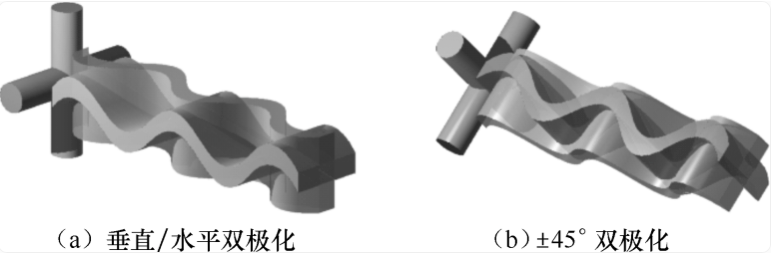

# 双极化收发天线下的 MIMO-OFDM 信道建模

> 本文讨论在 MIMO-OFDM 信道建模中引入双极化收发天线后的系统模型、建模动机、与传统 MIMO-OFDM 信道模型的区别，以及常用的统计相关模型和角度-时延域几何模型。

## 目录

- [1 背景与动机](#1-背景与动机)
  - [1.1 传统 MIMO-OFDM 信道建模](#11-传统-mimo-ofdm-信道建模)
  - [1.2 极化天线基础](#12-极化天线基础)
  - [1.3 双极化与普通多天线端口的区别](#13-双极化与普通多天线端口的区别)
  - [1.4 双极化建模和单极化建模区别点](#14-双极化建模和单极化建模区别点)
- [2 Notation](#2-notation)
- [3 双极化 MIMO-OFDM 系统模型](#3-双极化-mimo-ofdm-系统模型)
  - [3.1 端口、物理天线位置与极化维度](#31-端口物理天线位置与极化维度)
  - [3.2 频域输入输出模型](#32-频域输入输出模型)
  - [3.3 极化子信道分块表示](#33-极化子信道分块表示)
  - [3.4 极化基变换](#34-极化基变换)
- [4 与传统 MIMO-OFDM 建模的区别](#4-与传统-mimo-ofdm-建模的区别)
- [5 Kronecker 空间-极化相关模型](#5-kronecker-空间-极化相关模型)
  - [5.1 传统 Kronecker 模型](#51-传统-kronecker-模型)
  - [5.2 空间-极化联合相关矩阵](#52-空间-极化联合相关矩阵)
  - [5.3 XPR/XPD 与极化耦合](#53-xprxpd-与极化耦合)
  - [5.4 双极化 Kronecker TDL/CFR 生成](#54-双极化-kronecker-tdlcfr-生成)
- [6 角度-时延域双极化几何模型](#6-角度-时延域双极化几何模型)
  - [6.1 普通角度-时延域 MIMO 模型](#61-普通角度-时延域-mimo-模型)
  - [6.2 路径级 2x2 极化耦合矩阵](#62-路径级-2x2-极化耦合矩阵)
  - [6.3 带极化响应的阵列导向矢量](#63-带极化响应的阵列导向矢量)
  - [6.4 双极化 OFDM CFR](#64-双极化-ofdm-cfr)
  - [6.5 几何模型典型场景参数设置](#65-几何模型典型场景参数设置)
- [7 仿真建模流程](#7-仿真建模流程)
- [参考文献](#参考文献)

# 1 背景与动机

## 1.1 传统 MIMO-OFDM 信道建模

在传统 MIMO-OFDM 系统中，第 $m$ 个 OFDM 符号、第 $k$ 个子载波上的频域输入输出模型通常写为：

$$
\mathbf y[m,k]
=
\mathbf H[m,k]\mathbf x[m,k]+\mathbf w[m,k],
$$

其中：

$$
\mathbf H[m,k]\in\mathbb C^{N_r\times N_t}.
$$

$N_t$ 是发射天线端口数，$N_r$ 是接收天线端口数。矩阵元素 $H_{r,t}[m,k]$ 表示第 $t$ 个发射端口到第 $r$ 个接收端口的子信道。

传统 MIMO-OFDM 信道建模主要关注 3 类选择性：

| 维度 | 物理来源 | 常用数学对象 |
|---|---|---|
| 频率选择性 | 时延扩展 | PDP、TDL、CDL、CIR/CFR |
| 时间选择性 | 多普勒扩展 | Jakes、AR、BEM、多普勒谱 |
| 空间选择性 | 多天线阵列、AoA/AoD | 空间相关矩阵、阵列导向矢量、角度域稀疏性 |

若不显式考虑极化，每个天线端口通常被视为一个标量端口。信道矩阵只描述不同收发端口之间的复增益、相位、相关性和频率选择性。

这里需要注意：**不显式考虑极化**不等于真实天线没有极化，而是把极化效应吸收到标量复信道系数中。例如一个传统 MIMO 信道元素可以写成：

$$
H_{r,t}[m,k]
=
\sum_{\ell}
\alpha_{\ell,r,t}[m]
e^{-j\frac{2\pi}{N}k\tau_\ell}.
$$

这个 $\alpha_{\ell,r,t}$ 可以隐含天线方向图、极化匹配、反射和散射造成的极化旋转，但模型没有单独告诉我们这些效应来自哪里。

## 1.2 极化天线基础

电磁波的极化通常用电场矢量的空间指向来描述：在空间某个位置，沿电磁波传播方向看去，电场矢量端点随时间变化所描绘出的轨迹，就是该电磁波的极化状态。

天线的极化由其辐射或接收的电磁波极化来确定。更工程化地说：

- 作发射天线时，天线极化是其在最大增益方向上辐射电磁波的极化；
- 作接收天线时，天线极化是能使天线终端获得最大可用功率的入射波极化。

下图为双极化天线的实例，参考文献 [1]。

所有实际天线都有极化特性。不同天线结构可以产生不同极化状态，例如：

- 垂直放置的偶极子天线：主要辐射垂直线极化波；
- 水平放置的偶极子天线：主要辐射水平线极化波；
- 螺旋天线：可以设计为圆极化；
- 贴片天线：可以设计为线极化或圆极化。

**偶极子天线**是一种最基本的线状天线，通常由两段导体组成并从中间馈电。最经典的是半波偶极子，其总长度约为半个波长。半波偶极子的典型辐射方向图近似“甜甜圈”：在垂直于天线轴线的方向辐射最强，在天线轴线方向辐射最弱。偶极子的摆放方向决定了其主要线极化方向。

**极化匹配**描述发射波极化和接收天线极化之间的匹配程度。在线极化情况下，若发射极化方向和接收极化方向夹角为 $\theta$，接收电压幅度近似按 $\cos\theta$ 缩放，接收功率近似按：

$$
P_r \propto \cos^2\theta
$$

变化。因此：

- $\theta=0^\circ$ 时极化匹配最好；
- $\theta=45^\circ$ 时约有 $3$ dB 极化失配损耗；
- $\theta=90^\circ$ 时理想线极化模型下接收功率接近 0。

实际无线传播中，建筑物反射、绕射、散射、人体遮挡、车辆和金属表面都会改变电磁波极化状态，使原本的垂直极化、水平极化或 $\pm45^\circ$ 极化发生旋转或去极化。因此，在移动通信信道中，极化失配和交叉极化泄漏通常不能忽略。

## 1.3 双极化与普通多天线端口的区别

可以根据天线端口的极化特性，把工程天线粗略分为单极化和双极化。

**单极化天线**指一个天线端口主要对应一种极化方向，例如垂直极化、水平极化、$+45^\circ$ 极化或右旋圆极化。单极化并不等于“只有一根导体”，也不等于只能收不能发；它强调的是每个端口只标称一种主要极化状态。

**双极化天线**通常指在相同或近似相同的物理位置上集成两个近似正交的极化端口，例如：

$$
\{V,H\}
\quad \text{或} \quad
\{+45^\circ,-45^\circ\}.
$$

在基站面板中，最常见的是 $\pm45^\circ$ 双极化阵元。两个极化端口可以同时作为独立的射频端口参与 MIMO 传输，但它们并不是两根空间上完全独立的天线：它们共享相同或相近的物理位置、相似的空间方向图，并通过极化隔离度和传播去极化程度产生耦合。

从工程角度看，单极化和双极化的主要差异如下。

| 维度 | 单极化天线 | 双极化天线 |
|---|---|---|
| 端口极化 | 一个端口主要对应一种极化 | 同一位置通常有两个正交极化端口 |
| 面板尺寸 | 增加端口通常需要更多物理位置 | 可在相同位置增加一个极化维度 |
| MIMO 端口数 | 主要依靠空间阵元数增加 | 空间位置数 $\times$ 极化端口数 |
| 相关性来源 | 主要是空间相关 | 同时有空间相关、极化相关和极化耦合 |
| 关键参数 | 阵列间距、方向图、AoA/AoD | 额外包括 XPR/XPD、极化隔离、交叉极化泄漏 |

双极化天线在移动通信中常用，主要原因包括：

1. **提高面板端口密度**

   在同一物理位置放置两个正交极化端口，可以在不显著增大面板尺寸的情况下增加 MIMO 端口数。

2. **提供极化分集**

   当用户姿态、传播路径或反射环境导致极化状态变化时，两个正交极化端口可以降低单一极化失配造成的深衰落风险。

3. **支持空间复用和波束赋形**

   双极化端口可作为独立 MIMO 端口参与预编码、波束赋形和 CSI 反馈。NR 中常见的 CSI-RS 端口和 Type I/Type II 码本都与双极化面板结构密切相关。

4. **适应城区复杂传播**

   在城区，电磁波经过建筑物、玻璃幕墙、金属结构和地面反射后，极化状态会发生旋转。此时单一垂直极化不一定始终最优，双极化可以提供更稳健的接收和传输能力。

不过，双极化并不意味着容量一定翻倍。两个极化端口能否提供接近独立的信道，取决于极化隔离、XPR/XPD、散射环境、用户天线姿态、阵列相关性以及接收机能力。若两个极化端口高度相关，或交叉极化泄漏过强/过弱导致有效秩不足，则双极化带来的复用增益会下降。

我们之前讨论的信道建模通常没有显式考虑双极化天线的影响。LTE 和 NR 的基站天线、CSI-RS 端口、码本反馈和 3GPP CDL 信道模型都大量使用双极化建模。因此，如果要分析 NR 下行 MIMO、码本、波束赋形和 CSI 反馈，仅把双极化端口当作“普通独立天线”是不够的。

## 1.4 双极化建模和单极化建模区别点

从基带信号处理角度看，双极化端口可以被并入普通 MIMO 端口数：

$$
N_t^{\mathrm{port}} = N_t^{\mathrm{pos}}N_t^{\mathrm{pol}},
\qquad
N_r^{\mathrm{port}} = N_r^{\mathrm{pos}}N_r^{\mathrm{pol}}.
$$

如果每个物理天线位置有两个极化端口，则：

$$
N_t^{\mathrm{pol}}=2,\qquad N_r^{\mathrm{pol}}=2.
$$

因此，信道矩阵仍然可以写成：

$$
\mathbf H[m,k]\in
\mathbb C^{N_r^{\mathrm{port}}\times N_t^{\mathrm{port}}}.
$$

但是，双极化端口不能简单理解为“多了几根独立天线”。它在传统空间—时延—角度模型之上，叠加极化维度，将每条多径视为一个极化变换网络。区别不仅是增加端口数，更在于必须刻画去极化效应、全极化天线响应、空间‑极化联合相关，以及 XPD 等极化参数的影响。

接下来，我们会介绍如何建模双极化MIMO-OFDM系统。

# 2 Notation

| 符号 | 含义 |
|---|---|
| $m$ | OFDM 符号索引 |
| $k$ | OFDM 子载波索引 |
| $n$ | 离散时延 tap 索引 |
| $\ell$ | 物理路径、簇或射线索引 |
| $N$ | OFDM FFT 点数或子载波数 |
| $N_t^{\mathrm{pos}}$ | 发射端物理天线位置数 |
| $N_r^{\mathrm{pos}}$ | 接收端物理天线位置数 |
| $N_t^{\mathrm{pol}}$ | 发射端每个位置的极化端口数，双极化时通常为 2 |
| $N_r^{\mathrm{pol}}$ | 接收端每个位置的极化端口数，双极化时通常为 2 |
| $N_t^{\mathrm{port}}$ | 发射端总端口数，$N_t^{\mathrm{pos}}N_t^{\mathrm{pol}}$ |
| $N_r^{\mathrm{port}}$ | 接收端总端口数，$N_r^{\mathrm{pos}}N_r^{\mathrm{pol}}$ |
| $\mathcal P_t,\mathcal P_r$ | 发射端和接收端极化集合，如 $\{V,H\}$ 或 $\{+45^\circ,-45^\circ\}$ |
| $\mathbf x[m,k]$ | 发射向量，$\mathbb C^{N_t^{\mathrm{port}}\times 1}$ |
| $\mathbf y[m,k]$ | 接收向量，$\mathbb C^{N_r^{\mathrm{port}}\times 1}$ |
| $\mathbf H[m,k]$ | 双极化 MIMO-OFDM CFR 矩阵 |
| $\mathbf H[m,n]$ | 双极化 MIMO-OFDM CIR tap 矩阵 |
| $\mathbf R_t,\mathbf R_r$ | 发射端、接收端联合空间-极化相关矩阵 |
| $\mathbf R_{t,\mathrm{space}},\mathbf R_{r,\mathrm{space}}$ | 发射端、接收端空间位置相关矩阵 |
| $\mathbf R_{t,\mathrm{pol}},\mathbf R_{r,\mathrm{pol}}$ | 发射端、接收端极化相关矩阵 |
| $\rho_{\mathrm{pol}}$ | 两个极化端口之间的相关系数 |
| $\mathrm{XPR}$ | Cross-Polarization Power Ratio，交叉极化功率比 |
| $\mathrm{XPD}$ | Cross-Polarization Discrimination，交叉极化鉴别度 |
| $\kappa$ | XPR 的线性值 |
| $\mathbf P_\ell$ | 第 $\ell$ 条路径的 $2\times2$ 极化耦合矩阵 |
| $\mathbf B$ | 极化基变换矩阵 |
| $\mathbf \Pi_t,\mathbf \Pi_r$ | 发射端和接收端端口重排置换矩阵 |
| $\mathbf a_t(\Omega_{t,\ell})$ | 发射端空间阵列导向矢量 |
| $\mathbf a_r(\Omega_{r,\ell})$ | 接收端空间阵列导向矢量 |
| $\mathbf b_t^{(p)}(\Omega)$ | 发射端第 $p$ 个极化的方向图或极化响应 |
| $\mathbf b_r^{(p)}(\Omega)$ | 接收端第 $p$ 个极化的方向图或极化响应 |
| $P_\ell$ | 第 $\ell$ 条路径平均功率 |
| $\tau_\ell$ | 第 $\ell$ 条路径时延 |
| $\alpha_\ell$ | 第 $\ell$ 条路径复增益 |
| $\sigma_w^2$ | AWGN 噪声方差 |
| $\otimes$ | Kronecker 积 |
| $\mathrm{vec}(\cdot)$ | 按列向量化 |

# 3 双极化 MIMO-OFDM 系统模型

## 3.1 端口、物理天线位置与极化维度

双极化阵列中，需要区分两个概念：

- **物理天线位置**：阵列中不同空间位置的天线单元；
- **极化端口**：同一位置上不同极化方向的端口。

发射端端口可以用二元索引表示：

$$
(i_t,p_t),
$$

其中：

- $i_t=0,\dots,N_t^{\mathrm{pos}}-1$ 是发射端物理位置索引；
- $p_t\in\mathcal P_t$ 是发射端极化索引。

接收端类似：

$$
(i_r,p_r).
$$

为了写成普通 MIMO 矩阵，可以把二元索引展平为端口索引：

$$
t = i_t N_t^{\mathrm{pol}} + p_t,
\qquad
r = i_r N_r^{\mathrm{pol}} + p_r.
$$

这里默认 $p_t,p_r$ 已经映射为整数索引，例如 $V\mapsto0$、$H\mapsto1$。这种写法是**位置优先**的端口排列：

$$
\left[
(0,V),(0,H),(1,V),(1,H),\dots
\right].
$$

另一种常见写法是**极化优先**排列：

$$
\left[
(0,V),(1,V),\dots,(0,H),(1,H),\dots
\right].
$$

这两种排列只是端口编号不同，物理信道不变。若需要在两种排列之间切换，可以使用置换矩阵：

$$
\mathbf H_{\mathrm{pol\ first}}
=
\mathbf \Pi_r
\mathbf H_{\mathrm{pos\ first}}
\mathbf \Pi_t^T.
$$

展平后，双极化系统仍然是 MIMO 系统，但端口相关结构不再只是空间相关。

## 3.2 频域输入输出模型

第 $m$ 个 OFDM 符号、第 $k$ 个子载波上，双极化 MIMO-OFDM 的输入输出模型为：

$$
\boxed{
\mathbf y[m,k]
=
\mathbf H[m,k]\mathbf x[m,k]+\mathbf w[m,k]
}
$$

其中：

$$
\mathbf x[m,k]\in\mathbb C^{N_t^{\mathrm{port}}\times1},
\quad
\mathbf y[m,k]\in\mathbb C^{N_r^{\mathrm{port}}\times1},
$$

$$
\mathbf H[m,k]\in
\mathbb C^{N_r^{\mathrm{port}}\times N_t^{\mathrm{port}}}.
$$

离散时延域和频域的关系仍然是 OFDM 信道建模中的 DFT 关系：

$$
\boxed{
\mathbf H[m,k]
=
\sum_{n=0}^{L_h-1}
\mathbf H[m,n]e^{-j\frac{2\pi}{N}kn}
}
$$

区别在于 $\mathbf H[m,n]$ 的行列索引现在同时包含空间位置和极化端口。

## 3.3 极化子信道分块表示

以 $V/H$ 双极化为例，如果发射端和接收端都采用双极化端口，则可把信道矩阵按极化分块。下面的分块表达默认端口已经按“极化优先”排列，或者已经通过 $\mathbf \Pi_t,\mathbf \Pi_r$ 完成重排：

$$
\mathbf H[m,k]
=
\begin{bmatrix}
\mathbf H_{VV}[m,k] & \mathbf H_{VH}[m,k]\\
\mathbf H_{HV}[m,k] & \mathbf H_{HH}[m,k]
\end{bmatrix}.
$$

这里每个子块的维度为：

$$
\mathbf H_{p_rp_t}[m,k]
\in
\mathbb C^{N_r^{\mathrm{pos}}\times N_t^{\mathrm{pos}}},
\qquad
p_r,p_t\in\{V,H\}.
$$

各子块含义为：

| 子块 | 含义 |
|---|---|
| $\mathbf H_{VV}$ | 发射 V 极化到接收 V 极化的同极化信道 |
| $\mathbf H_{HH}$ | 发射 H 极化到接收 H 极化的同极化信道 |
| $\mathbf H_{VH}$ | 发射 H 极化到接收 V 极化的交叉极化信道 |
| $\mathbf H_{HV}$ | 发射 V 极化到接收 H 极化的交叉极化信道 |

理想极化隔离下，交叉极化子块很小：

$$
\|\mathbf H_{VH}\|_F^2,\ \|\mathbf H_{HV}\|_F^2
\ll
\|\mathbf H_{VV}\|_F^2,\ \|\mathbf H_{HH}\|_F^2.
$$

实际传播中，反射、绕射、散射和天线方向图都会导致极化旋转，因此交叉极化项通常不能直接忽略。

## 3.4 极化基变换

极化可以用不同基表示。常见基包括：

- $V/H$：垂直/水平极化；
- $+45^\circ/-45^\circ$：斜极化；
- $L/R$：左旋/右旋圆极化。

不同极化基之间可以通过 $2\times2$ 酉矩阵变换。例如，若以 $V/H$ 为基，$\pm45^\circ$ 极化可以写成：

$$
\begin{bmatrix}
e_{+45}\\
e_{-45}
\end{bmatrix}
=
\frac{1}{\sqrt{2}}
\begin{bmatrix}
1 & 1\\
1 & -1
\end{bmatrix}
\begin{bmatrix}
e_V\\
e_H
\end{bmatrix}.
$$

记极化基变换矩阵为 $\mathbf B$，则极化耦合矩阵在新基下可写为：

$$
\boxed{
\mathbf P_\ell^{(\mathrm{new})}
=
\mathbf B_r
\mathbf P_\ell^{(V/H)}
\mathbf B_t^H
}
$$

其中 $\mathbf B_t$ 和 $\mathbf B_r$ 分别表示发射端和接收端的极化基变换。这个表达说明：$V/H$ 和 $\pm45^\circ$ 并不是两种完全不同的物理模型，而是对同一极化传播过程的不同坐标表示。实际仿真中要保证天线端口定义、方向图、XPR 参数和码本端口排列使用一致的极化基。

# 4 与传统 MIMO-OFDM 建模的区别

双极化 MIMO-OFDM 建模和传统 MIMO-OFDM 建模的关系可以概括为：

> 双极化模型仍然是 MIMO-OFDM 模型，但端口维度从“空间端口”扩展为“空间位置 $\times$ 极化端口”的联合维度。

主要区别如下。

| 对比项 | 传统 MIMO-OFDM | 双极化 MIMO-OFDM |
|---|---|---|
| 端口含义 | 通常只表示不同天线位置或不同阵元 | 同时包含空间位置和极化方向 |
| 信道矩阵维度 | $N_r\times N_t$ | $N_r^{\mathrm{pos}}N_r^{\mathrm{pol}}\times N_t^{\mathrm{pos}}N_t^{\mathrm{pol}}$ |
| 相关性 | 主要考虑空间相关 | 需要考虑空间相关、极化相关、空间-极化耦合 |
| 子信道结构 | 每个天线对一个标量信道 | 可分为同极化和交叉极化子信道 |
| 几何模型 | 路径增益多为标量 $\alpha_\ell$ | 路径增益扩展为 $2\times2$ 极化耦合矩阵 |
| 关键参数 | PDP、AoA/AoD、Doppler、空间相关 | 额外需要 XPR/XPD、极化方向图、极化相关 |
| 适用性 | 普通多天线链路级仿真 | 更贴近双极化基站阵列和实际 5G/6G 天线面板 |

因此，双极化建模不是简单给普通 MIMO 信道矩阵加一个更大的相关矩阵，而是要明确端口结构和极化传播机制。

# 5 Kronecker 空间-极化相关模型

## 5.1 传统 Kronecker 模型

传统平坦 MIMO Kronecker 相关模型常写为：

$$
\boxed{
\mathbf H
=
\mathbf R_r^{1/2}
\mathbf H_w
\left(\mathbf R_t^{1/2}\right)^T
}
$$

其中：

- $\mathbf H_w$ 是 i.i.d. 复高斯矩阵；
- $\mathbf R_t$ 是发射端空间相关矩阵；
- $\mathbf R_r$ 是接收端空间相关矩阵。

向量化后：

$$
\mathrm{vec}(\mathbf H)
\sim
\mathcal{CN}
\left(
\mathbf 0,\,
\mathbf R_t^T\otimes\mathbf R_r
\right).
$$

在宽带 TDL 模型中，可对每个时延 tap 使用类似结构：

$$
\mathbf H[m,n]
=
\sqrt{P_n}
\mathbf R_r^{1/2}
\mathbf W[m,n]
\left(\mathbf R_t^{1/2}\right)^T.
$$

## 5.2 空间-极化联合相关矩阵

双极化下，$\mathbf R_t$ 和 $\mathbf R_r$ 不应只表示空间位置相关，而应表示**空间-极化联合相关**。

一种常用简化方式是假设空间相关和极化相关可分离：

$$
\boxed{
\mathbf R_t
=
\mathbf R_{t,\mathrm{space}}
\otimes
\mathbf R_{t,\mathrm{pol}}
}
$$

$$
\boxed{
\mathbf R_r
=
\mathbf R_{r,\mathrm{space}}
\otimes
\mathbf R_{r,\mathrm{pol}}
}
$$

其中：

$$
\mathbf R_{t,\mathrm{space}}
\in
\mathbb C^{N_t^{\mathrm{pos}}\times N_t^{\mathrm{pos}}},
\quad
\mathbf R_{t,\mathrm{pol}}
\in
\mathbb C^{N_t^{\mathrm{pol}}\times N_t^{\mathrm{pol}}},
$$

$$
\mathbf R_{r,\mathrm{space}}
\in
\mathbb C^{N_r^{\mathrm{pos}}\times N_r^{\mathrm{pos}}},
\quad
\mathbf R_{r,\mathrm{pol}}
\in
\mathbb C^{N_r^{\mathrm{pol}}\times N_r^{\mathrm{pol}}}.
$$

双极化时，极化相关矩阵常取 $2\times2$ 形式。例如：

$$
\boxed{
\mathbf R_{\mathrm{pol}}
=
\begin{bmatrix}
1 & \rho_{\mathrm{pol}}\\
\rho_{\mathrm{pol}}^* & 1
\end{bmatrix}
}
$$

$\rho_{\mathrm{pol}}$ 描述同一位置上两个极化端口之间的统计相关性。

若只用该相关矩阵，模型能够描述两个极化端口“相关或不相关”，但还不能完整描述交叉极化功率泄漏。因此通常还需要 XPR/XPD 参数。

需要强调的是：

$$
\mathbf R_{\mathrm{space\text{-}pol}}
=
\mathbf R_{\mathrm{space}}\otimes\mathbf R_{\mathrm{pol}}
$$

是一个**可分离近似**。它隐含两个假设：

1. 空间相关性不随极化端口变化；
2. 极化相关性不随阵列位置、入射角和出射角变化。

真实天线面板中，这两个假设未必严格成立。例如不同极化端口的方向图可能不同，阵列边缘单元和中心单元的耦合也可能不同，某些角度上的交叉极化泄漏更强。因此，更一般的联合相关矩阵应直接写成：

$$
\mathbf R_{\mathrm{space\text{-}pol}}
\in
\mathbb C^{N^{\mathrm{port}}\times N^{\mathrm{port}}},
$$

并不一定能分解为两个小矩阵的 Kronecker 积。链路级算法验证常使用可分离模型；若要研究真实天线面板和方向图影响，应使用非可分离联合相关或几何模型。

## 5.3 XPR/XPD 与极化耦合

XPR（Cross-Polarization Power Ratio）定义为同极化功率与交叉极化功率之比：

$$
\boxed{
\mathrm{XPR}
=
\frac{P_{\mathrm{co}}}{P_{\mathrm{cross}}}
}
$$

以线性值表示时，若 $\mathrm{XPR}=10$，表示交叉极化功率约为同极化功率的 $1/10$。以 dB 表示：

$$
\mathrm{XPR}_{\mathrm{dB}}
=
10\log_{10}(\mathrm{XPR}).
$$

XPD（Cross-Polarization Discrimination）更常用于描述天线或链路对交叉极化的抑制能力。它通常也写成同极化接收功率与交叉极化接收功率之比：

$$
\mathrm{XPD}
=
\frac{P_{\mathrm{matched}}}{P_{\mathrm{orthogonal}}}.
$$

在很多链路级仿真中，XPR 和 XPD 都表现为“同极化功率 / 交叉极化功率”的比值，因此容易混用。但二者侧重点不同：

| 参数 | 更常描述 | 典型位置 |
|---|---|---|
| XPR | 传播路径、簇或射线中的交叉极化功率比例 | 信道模型、CDL 路径参数 |
| XPD | 天线或测量链路对正交极化的鉴别能力 | 天线指标、系统测量 |

因此，几何信道模型中通常把 $\kappa_\ell$ 理解为路径或簇级 XPR；若研究天线方向图和端口隔离，也可以额外引入天线侧 XPD 或端口隔离参数。

对 $V/H$ 双极化信道，一个简单的极化功率缩放矩阵可以写成：

$$
\mathbf S_{\mathrm{pol}}
=
\begin{bmatrix}
1 & \frac{1}{\sqrt{\kappa}}\\
\frac{1}{\sqrt{\kappa}} & 1
\end{bmatrix},
\qquad
\kappa=\mathrm{XPR}.
$$

这里 $1/\sqrt{\kappa}$ 作用在幅度上，因此交叉极化功率约为 $1/\kappa$。

更一般地，对第 $\ell$ 条路径，可以定义路径级极化耦合矩阵：

$$
\boxed{
\mathbf P_\ell
=
\begin{bmatrix}
\alpha_{\ell,VV} & \alpha_{\ell,VH}\\
\alpha_{\ell,HV} & \alpha_{\ell,HH}
\end{bmatrix}
}
$$

其中常见功率关系为：

$$
\mathbb E|\alpha_{\ell,VV}|^2
\approx
\mathbb E|\alpha_{\ell,HH}|^2
=
1,
$$

$$
\mathbb E|\alpha_{\ell,VH}|^2
\approx
\mathbb E|\alpha_{\ell,HV}|^2
=
\frac{1}{\kappa_\ell}.
$$

$\kappa_\ell$ 可以是固定值，也可以随路径、簇、场景随机变化。

## 5.4 双极化 Kronecker TDL/CFR 生成

在双极化 Kronecker TDL 模型中，每个 tap 的 CIR 可以写成：

$$
\boxed{
\mathbf H[m,n]
=
\sqrt{P_n}
\mathbf R_r^{1/2}
\mathbf W[m,n]
\left(\mathbf R_t^{1/2}\right)^T
}
$$

其中：

$$
\mathbf R_t
=
\mathbf R_{t,\mathrm{space}}\otimes\mathbf R_{t,\mathrm{pol}},
\qquad
\mathbf R_r
=
\mathbf R_{r,\mathrm{space}}\otimes\mathbf R_{r,\mathrm{pol}}.
$$

$\mathbf W[m,n]$ 是维度为：

$$
N_r^{\mathrm{port}}\times N_t^{\mathrm{port}}
$$

的 i.i.d. 复高斯矩阵。若需要显式 XPR，可在生成 $\mathbf W[m,n]$ 后按极化子块缩放，或者直接构造带极化功率结构的 $\mathbf W_{\mathrm{pol}}[m,n]$。

然后通过 DFT 得到 CFR：

$$
\boxed{
\mathbf H[m,k]
=
\sum_{n=0}^{L_h-1}
\mathbf H[m,n]e^{-j\frac{2\pi}{N}kn}
}
$$

这种模型的优点是实现简单、参数少、便于分析信道估计和 BER/NMSE。缺点是物理解释较弱，尤其不能准确描述每条路径的 AoD-AoA-极化联合耦合。

# 6 角度-时延域双极化几何模型

## 6.1 普通角度-时延域 MIMO 模型

传统几何 MIMO 信道通常写成路径叠加：

$$
\mathbf H[m,k]
=
\sum_{\ell=1}^{L}
\sqrt{P_\ell}
\alpha_\ell[m]
\mathbf a_r(\Omega_{r,\ell})
\mathbf a_t^H(\Omega_{t,\ell})
e^{-j\frac{2\pi}{N}k\tau_\ell}.
$$

其中每条路径贡献一个秩一矩阵：

$$
\mathbf a_r(\Omega_{r,\ell})
\mathbf a_t^H(\Omega_{t,\ell}).
$$

该模型显式描述：

- AoA：$\Omega_{r,\ell}$；
- AoD：$\Omega_{t,\ell}$；
- 时延：$\tau_\ell$；
- 多普勒或时间变化：$\alpha_\ell[m]$；
- 路径功率：$P_\ell$。

但普通模型中路径增益 $\alpha_\ell[m]$ 是标量，无法描述极化旋转和交叉极化泄漏。

## 6.2 路径级 2x2 极化耦合矩阵

第 $\ell$ 条路径的 $2\times2$ 极化耦合矩阵用于描述该路径中发射极化分量到接收极化分量之间的线性变换，体现极化方向匹配、极化旋转、交叉极化泄漏和去极化等传播效应。

$$
\boxed{
\mathbf P_\ell[m]
=
\begin{bmatrix}
\alpha_{\ell,VV}[m] & \alpha_{\ell,VH}[m]\\
\alpha_{\ell,HV}[m] & \alpha_{\ell,HH}[m]
\end{bmatrix}
}
$$

矩阵元素表示：

| 元素 | 含义 |
|---|---|
| $\alpha_{\ell,VV}$ | 发射 V 到接收 V 的同极化路径增益 |
| $\alpha_{\ell,HH}$ | 发射 H 到接收 H 的同极化路径增益 |
| $\alpha_{\ell,VH}$ | 发射 H 到接收 V 的交叉极化路径增益 |
| $\alpha_{\ell,HV}$ | 发射 V 到接收 H 的交叉极化路径增益 |

一个常用随机参数化为：

$$
\mathbf P_\ell[m]
=
\begin{bmatrix}
e^{j\phi_{\ell,VV}[m]} &
\sqrt{\kappa_\ell^{-1}}e^{j\phi_{\ell,VH}[m]}\\
\sqrt{\kappa_\ell^{-1}}e^{j\phi_{\ell,HV}[m]} &
e^{j\phi_{\ell,HH}[m]}
\end{bmatrix},
$$

其中 $\kappa_\ell=\mathrm{XPR}_\ell$，$\phi_{\ell,\cdot}$ 是随机相位或随时间演化的相位。

如果需要包含路径复幅度，可写成：

$$
\mathbf P_\ell[m]
=
\beta_\ell[m]
\begin{bmatrix}
e^{j\phi_{\ell,VV}[m]} &
\sqrt{\kappa_\ell^{-1}}e^{j\phi_{\ell,VH}[m]}\\
\sqrt{\kappa_\ell^{-1}}e^{j\phi_{\ell,HV}[m]} &
e^{j\phi_{\ell,HH}[m]}
\end{bmatrix}.
$$

其中 $\beta_\ell[m]$ 描述该路径整体的时间选择性衰落。

## 6.3 带极化响应的阵列导向矢量

如果每个位置有两个极化端口，阵列响应不只是空间相位，还包含极化方向图响应。

对第 $\ell$ 条路径，发射端可定义双极化阵列响应矩阵：

$$
\mathbf A_t(\Omega_{t,\ell})
=
\begin{bmatrix}
\mathbf a_{t,V}(\Omega_{t,\ell}) &
\mathbf a_{t,H}(\Omega_{t,\ell})
\end{bmatrix}
\in
\mathbb C^{N_t^{\mathrm{port}}\times 2}.
$$

接收端类似：

$$
\mathbf A_r(\Omega_{r,\ell})
=
\begin{bmatrix}
\mathbf a_{r,V}(\Omega_{r,\ell}) &
\mathbf a_{r,H}(\Omega_{r,\ell})
\end{bmatrix}
\in
\mathbb C^{N_r^{\mathrm{port}}\times 2}.
$$

其中 $\mathbf a_{t,V}$ 和 $\mathbf a_{t,H}$ 不仅包含阵列空间相位，还包含对应极化端口的方向图、增益和相位响应。

若忽略方向图差异，只考虑每个位置的空间相位，则可以近似写成：

$$
\mathbf A_t(\Omega)
\approx
\mathbf a_{t,\mathrm{space}}(\Omega)\otimes\mathbf I_2,
$$

$$
\mathbf A_r(\Omega)
\approx
\mathbf a_{r,\mathrm{space}}(\Omega)\otimes\mathbf I_2.
$$

该近似适合算法验证，但不适合分析真实天线方向图、俯仰角、方位角和极化方向图耦合。

## 6.4 双极化 OFDM CFR

引入极化耦合矩阵后，第 $\ell$ 条路径对 CFR 的贡献为：

$$
\boxed{
\mathbf H_\ell[m,k]
=
\sqrt{P_\ell}
\mathbf A_r(\Omega_{r,\ell})
\mathbf P_\ell[m]
\mathbf A_t^H(\Omega_{t,\ell})
e^{-j\frac{2\pi}{N}k\tau_\ell}
}
$$

因此完整双极化几何 MIMO-OFDM 信道为：

$$
\boxed{
\mathbf H[m,k]
=
\sum_{\ell=1}^{L}
\sqrt{P_\ell}
\mathbf A_r(\Omega_{r,\ell})
\mathbf P_\ell[m]
\mathbf A_t^H(\Omega_{t,\ell})
e^{-j\frac{2\pi}{N}k\tau_\ell}
}
$$

该式和普通角度-时延域 MIMO 模型的区别在于：

- 普通模型中路径增益是标量 $\alpha_\ell[m]$；
- 双极化模型中路径增益扩展为 $2\times2$ 极化耦合矩阵 $\mathbf P_\ell[m]$；
- 普通阵列导向矢量扩展为带极化响应的阵列响应矩阵 $\mathbf A_t,\mathbf A_r$。

如果进一步把 CFR 沿角度和时延离散化，可以得到角度-时延-极化域的稀疏表示。此时每条路径不仅对应 AoA/AoD/时延支撑，还对应一个极化耦合矩阵。

## 6.5 几何模型典型场景参数设置

角度-时延域双极化几何模型的参数比 Kronecker 模型更多。为了便于链路级仿真，可以先使用少量典型场景参数，再逐步对路径数、角度扩展、时延扩展、XPR 和移动速度做扫描。

### 典型场景参数表

下面给出一组适合算法验证的经验取值。它们不是替代 3GPP TR 38.901 的标准表格，而是用于自建仿真时的初始参数。

| 场景 | 路径数 $L$ | RMS 时延扩展 | AoD/AoA 角度扩展 | XPR [dB] | 速度 | 适用目标 |
|---|---:|---:|---:|---:|---:|---|
| LOS/开阔低散射 | 1-3 | 10-50 ns | 2-5 deg | 10-20 | 0-30 km/h | 验证波束对准、近似低秩信道 |
| 郊区/弱散射 NLOS | 4-8 | 50-200 ns | 5-15 deg | 7-15 | 3-60 km/h | 普通链路级 BER/NMSE |
| 城区宏站 UMa | 8-20 | 100-500 ns | 10-35 deg | 5-12 | 3-120 km/h | MIMO 秩、CSI 反馈、波束选择 |
| 室内热点 InH | 6-15 | 20-150 ns | 20-60 deg | 3-10 | 0-10 km/h | 丰富散射、极化混合、短距离链路 |
| 高频/毫米波稀疏信道 | 2-6 | 10-100 ns | 2-10 deg | 7-15 | 0-60 km/h | 稀疏角度域、波束训练 |

如果目标是和 NR 标准场景对齐，应使用 3GPP TR 38.901 的 CDL-A/B/C/D/E 或 TDL-A/B/C/D/E 参数。上表更适合做算法敏感性分析。

### 路径功率 $P_\ell$

几何模型中常用指数功率时延谱：

$$
\tilde{P}_\ell
=
e^{-\tau_\ell/\tau_{\mathrm{rms}}},
$$

再归一化：

$$
P_\ell
=
\frac{\tilde{P}_\ell}{\sum_{q=1}^{L}\tilde{P}_q}.
$$

其中 $\tau_{\mathrm{rms}}$ 控制时延扩展。若只需要简单可控的多径模型，也可以直接使用等功率路径：

$$
P_\ell=\frac{1}{L}.
$$

等功率模型更容易观察角度和极化参数的影响；指数 PDP 更接近常见宽带衰落信道。

### 路径时延 $\tau_\ell$

常用设置方式有两种。

**1. 均匀抽样后排序**

$$
\tau_\ell
\sim
\mathcal U(0,\tau_{\max}),
$$

然后按从小到大排序。通常可取：

$$
\tau_{\max}\approx 3\tau_{\mathrm{rms}}\sim 5\tau_{\mathrm{rms}}.
$$

**2. 指数抽样**

$$
\tau_\ell
\sim
\mathrm{Exponential}(\tau_{\mathrm{rms}}),
$$

然后减去最小时延，使第一条路径从 $0$ 开始：

$$
\tau_\ell
\leftarrow
\tau_\ell-\min_q\tau_q.
$$

指数抽样更容易产生少数强早到路径和较弱晚到路径。

### AoA/AoD 角度

可先为每个链路生成一个中心角：

$$
\bar{\Omega}_t,\quad \bar{\Omega}_r,
$$

再让每条路径围绕中心角随机扩展：

$$
\Omega_{t,\ell}
=
\bar{\Omega}_t+\Delta\Omega_{t,\ell},
\qquad
\Omega_{r,\ell}
=
\bar{\Omega}_r+\Delta\Omega_{r,\ell}.
$$

常用扰动模型为：

$$
\Delta\Omega_{t,\ell}
\sim
\mathcal N(0,\sigma_{\mathrm{AoD}}^2),
\qquad
\Delta\Omega_{r,\ell}
\sim
\mathcal N(0,\sigma_{\mathrm{AoA}}^2).
$$

其中：

- 小角度扩展：$\sigma_{\mathrm{AoD}},\sigma_{\mathrm{AoA}}\approx2^\circ\sim5^\circ$；
- 中等角度扩展：$10^\circ\sim20^\circ$；
- 丰富散射：$30^\circ\sim60^\circ$。

角度扩展越小，信道越接近低秩和强方向性；角度扩展越大，空间维度更丰富，但阵列相关和波束泄漏也更复杂。

### XPR 与极化耦合矩阵

几何模型中通常为每条路径设置一个 XPR：

$$
\kappa_\ell
=
10^{\mathrm{XPR}_{\ell,\mathrm{dB}}/10}.
$$

如果不使用标准模型参数，可以先设为固定值：

$$
\mathrm{XPR}_{\ell,\mathrm{dB}}
\in
\{3,6,10,15,20\}.
$$

也可以设为对数正态随机变量：

$$
\mathrm{XPR}_{\ell,\mathrm{dB}}
\sim
\mathcal N(\mu_{\mathrm{XPR}},\sigma_{\mathrm{XPR}}^2).
$$

经验上可取：

| 场景 | $\mu_{\mathrm{XPR}}$ | $\sigma_{\mathrm{XPR}}$ | 含义 |
|---|---:|---:|---|
| 强极化混合 | 3-6 dB | 2-4 dB | 交叉极化泄漏较强 |
| 中等极化混合 | 7-10 dB | 3-5 dB | 常用链路级基准 |
| 弱极化混合 | 12-20 dB | 3-6 dB | 极化隔离较好 |

路径级极化耦合矩阵可写成：

$$
\mathbf P_\ell[m]
=
\beta_\ell[m]
\begin{bmatrix}
e^{j\phi_{\ell,VV}} &
\sqrt{\kappa_\ell^{-1}}e^{j\phi_{\ell,VH}}\\
\sqrt{\kappa_\ell^{-1}}e^{j\phi_{\ell,HV}} &
e^{j\phi_{\ell,HH}}
\end{bmatrix}.
$$

相位通常取：

$$
\phi_{\ell,p_rp_t}
\sim
\mathcal U(-\pi,\pi).
$$

### 多普勒和时间变化

若考虑移动性，最大多普勒为：

$$
f_{D,\max}
=
\frac{v f_c}{c}.
$$

第 $\ell$ 条路径的多普勒可由移动方向和入射角夹角 $\vartheta_\ell$ 给出：

$$
f_{D,\ell}
=
f_{D,\max}\cos\vartheta_\ell.
$$

路径公共复增益可设为：

$$
\beta_\ell[m]
=
e^{j(2\pi f_{D,\ell}mT_{\mathrm{sym}}+\varphi_\ell)}.
$$

常见速度设置：

| 速度 | 场景 |
|---:|---|
| 0-3 km/h | 静止或低速室内 |
| 3-30 km/h | 行人、低速终端 |
| 30-120 km/h | 城区车辆 |
| 120-350 km/h | 高速铁路或高速移动 |

### 阵列和方向图响应

如果只做基础算法验证，可以使用理想阵列响应：

$$
\mathbf A_t(\Omega)
\approx
\mathbf a_{t,\mathrm{space}}(\Omega)\otimes\mathbf I_2,
\qquad
\mathbf A_r(\Omega)
\approx
\mathbf a_{r,\mathrm{space}}(\Omega)\otimes\mathbf I_2.
$$

如果要研究真实双极化天线影响，应为每个端口设置方向图：

$$
\mathbf f_{i,p}(\Omega)
=
\begin{bmatrix}
F_{i,p}^{(V)}(\Omega)\\
F_{i,p}^{(H)}(\Omega)
\end{bmatrix}.
$$

一个简化实现是：

- 主极化方向图使用阵元增益 $G_{\mathrm{co}}(\Omega)$；
- 交叉极化方向图使用 $G_{\mathrm{cross}}(\Omega)=G_{\mathrm{co}}(\Omega)/\mathrm{XPD}$；
- 相位独立均匀随机或由测量方向图给出。

### 推荐的起始仿真配置

若没有标准场景约束，可以先使用如下配置作为 baseline：

| 参数 | 建议值 |
|---|---|
| 路径数 $L$ | 6 或 8 |
| RMS 时延扩展 | 100 ns |
| AoD/AoA 角度扩展 | 15 deg |
| XPR | 10 dB |
| 极化相位 | 独立 $\mathcal U(-\pi,\pi)$ |
| 速度 | 30 km/h |
| 阵列响应 | 理想 UPA/ULA + 双极化端口 |
| 路径功率 | 指数 PDP 并归一化 |

然后分别扫描：

- XPR：$3,6,10,15,20$ dB；
- 角度扩展：$5^\circ,15^\circ,30^\circ,60^\circ$；
- 路径数：$2,4,8,16$；
- 速度：$0,3,30,120$ km/h。

这样可以分别观察极化耦合、角度扩展、多径丰富度和时间选择性对信道秩、预编码、信道估计和 BER 的影响。

# 7 仿真建模流程

双极化 MIMO-OFDM 信道仿真可按以下流程实现。

**Step 1：设置系统和阵列参数**

- $N_t^{\mathrm{pos}},N_r^{\mathrm{pos}}$；
- 极化数 $N_t^{\mathrm{pol}}=N_r^{\mathrm{pol}}=2$；
- OFDM 参数 $N,\Delta f,T_{\mathrm{cp}}$；
- 载频、速度、多普勒；
- 天线间距和阵列类型。

**Step 2：设置路径或 tap 参数**

- 路径数 $L$ 或 tap 数 $L_h$；
- PDP $P_\ell$；
- 时延 $\tau_\ell$；
- AoA/AoD；
- 多普勒频移。

**Step 3：设置极化参数**

- 极化基：$V/H$ 或 $+45^\circ/-45^\circ$；
- XPR/XPD；
- 极化相关系数 $\rho_{\mathrm{pol}}$；
- 是否使用极化方向图。

**Step 4A：若采用 Kronecker 模型**

1. 构造 $\mathbf R_{t,\mathrm{space}}$ 和 $\mathbf R_{r,\mathrm{space}}$；
2. 构造 $\mathbf R_{t,\mathrm{pol}}$ 和 $\mathbf R_{r,\mathrm{pol}}$；
3. 得到联合相关矩阵：

   $$
   \mathbf R_t
   =
   \mathbf R_{t,\mathrm{space}}\otimes\mathbf R_{t,\mathrm{pol}},
   \quad
   \mathbf R_r
   =
   \mathbf R_{r,\mathrm{space}}\otimes\mathbf R_{r,\mathrm{pol}}.
   $$

4. 生成每个 tap 的 i.i.d. 矩阵并施加相关；
5. 根据 XPR 缩放交叉极化子块；
6. 沿时延维 DFT 得到 CFR。

**Step 4B：若采用角度-时延域模型**

1. 为每条路径生成 AoA/AoD、时延和功率；
2. 为每条路径生成 XPR 和极化耦合矩阵 $\mathbf P_\ell$；
3. 构造带极化响应的阵列矩阵 $\mathbf A_t,\mathbf A_r$；
4. 按路径叠加公式生成 $\mathbf H[m,k]$；
5. 若需要时变信道，对 $\mathbf P_\ell[m]$ 或 $\beta_\ell[m]$ 引入多普勒相位。

# 参考文献

[1] [双极化天线](https://baike.baidu.com/item/双极化天线/8958690)

[2] [双极化和单极化天线的区别](https://support.huawei.com/enterprise/zh/doc/EDOC1000051014/693aff14)

[3] [移动通信为啥需要双极化天线？](https://www.rfask.net/article-924.html)

[4] 3GPP TR 38.901, "Study on channel model for frequencies from 0.5 to 100 GHz," dual-polarized antenna, XPR, CDL/TDL, and spatial channel modeling.

[5] 3GPP TS 38.211, "NR; Physical channels and modulation," antenna ports, CSI-RS, OFDM, and downlink physical channel definitions.

[6] C. A. Balanis, Antenna Theory: Analysis and Design, Wiley.

[7] A. Paulraj, R. Nabar, and D. Gore, Introduction to Space-Time Wireless Communications, Cambridge University Press, 2003.

[8] D. Tse and P. Viswanath, Fundamentals of Wireless Communication, Cambridge University Press, 2005.
